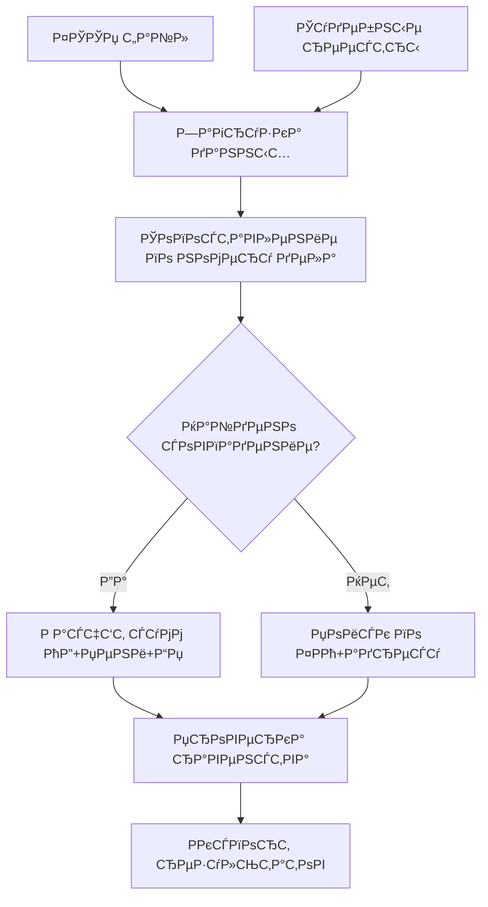

# DebtManagerApp2

[](https://python.org)
[]()
[]()

> **Desktop-приложение для управления задолженностями и анализа данных ФССП/ЕИРЦ**

GUI-приложение на Python (CustomTkinter) для загрузки, обработки и анализа данных о задолженностях из источников ФССП и ЕИРЦ. Включает поиск, сегментацию должников и экспорт отчётов.

---

## 🚀 Быстрый старт

### Установка

```bash
# Установка зависимостей
pip install -r requirements.txt

# Запуск приложения
python main.py
```

### Зависимости

| Пакет | Назначение |
|:------|:-----------|
| `customtkinter` | GUI фреймворк |
| `pandas` | Обработка данных |
| `openpyxl` | Работа с Excel |
| `dbfread` | Чтение DBF файлов |
| `matplotlib` | Диаграммы |
| `Levenshtein` | Нечёткий поиск |

---

## 📋 Возможности

- ✅ **Загрузка данных** из Excel (ФССП, ЕИРЦ, УЖХ, ЕИАС) и DBF (биллинг)
- ✅ **Обогащение ФССП** — сопоставление ИП с судебными решениями
- ✅ **Сегментация долга** — расчёт непросуженного долга по каждому ЛС
- ✅ **Экспорт результатов** в Excel с шаблонами
- ✅ **GUI интерфейс** на CustomTkinter с прогресс-баром и журналами
- ✅ **Поиск** по всем таблицам базы данных

---

## 📁 Структура проекта

```
DebtManagerApp2_v2/
├── main.py                 # Точка входа, главное окно
├── constants.py            # Константы и настройки
├── settings.json           # Пользовательские настройки
├── requirements.txt        # Зависимости Python
в”‚
├── core/                   # Бизнес-логика
│   ├── database.py        # Менеджер БД (SQLite)
│   ├── processor.py       # Процессор данных
│   ├── gui_controller.py  # Контроллер для GUI
│   ├── excel_engine.py    # Загрузка Excel файлов
│   ├── dbf_engine.py      # Чтение DBF файлов
│   ├── matchers.py        # Алгоритмы сопоставления
│   ├── normalizers.py     # Нормализация данных
│   └── export_engine.py   # Экспорт результатов
в”‚
├── gui/                    # Графический интерфейс
│   ├── sidebar.py         # Боковая панель
│   ├── settings.py        # Настройки
│   ├── tab_load.py        # Вкладка "Загрузка"
│   ├── tab_process1.py    # Вкладка "Обработка"
│   ├── tab_segment.py     # Вкладка "Сегментация"
│   ├── tab_search.py      # Вкладка "Поиск"
│   ├── tab_logs.py        # Вкладка "Журнал ошибок"
│   └── tab_help.py        # Вкладка "Помощь"
в”‚
├── docs/                   # Документация
│   ├── README.md          # Оглавление документации
│   ├── ТЗ.md              # Техническое задание
│   ├── DB_SCHEMA.md       # Схема базы данных
│   ├── CHANGELOG.md       # История изменений
│   └── ПРОБЛЕМЫ.md        # Известные проблемы
в”‚
├── assets/                 # Ресурсы (темы, иконки)
├── output/                 # Результаты обработки
└── tests/                  # Тесты
```

---

## 📊 Как это работает

### Часть 1: Обогащение ФССП



### Часть 2: Сегментация

1. Загружаются DBF файлы биллинга (начисления и сальдо)
2. Для каждого ЛС определяется **дата отсечки** (максимальная `date_end` из судебных решений)
3. Рассчитывается **глубина задолженности** (количество месяцев до даты отсечки)
4. Определяется **сумма непросуженного долга**
5. Результаты сохраняются в таблицу `processed_segmentation`

---

## 🗄️ База данных

| Таблица | Записей | Описание |
|:--------|:--------|:---------|
| `charges` | 1 298 591 | История начислений (DBF) |
| `address_linking` | 36 681 | Справочник ЛС с адресами |
| `raw_judgments` | 5 995 | Судебные решения |
| `raw_fssp` | 3 732 | Реестр ФССП |
| `processed_segmentation` | 26 758 | Результаты сегментации |

Полная схема: [docs/DB_SCHEMA.md](docs/DB_SCHEMA.md)

---

## 📚 Документация

| Раздел | Описание |
|:-------|:---------|
| [📖 Главная документация](docs/README.md) | Полное руководство по проекту |
| [📋 Техническое задание](docs/ТЗ.md) | Детальное описание задач и алгоритмов |
| [🗄️ Схема базы данных](docs/DB_SCHEMA.md) | Структура таблиц и связи |
| [📝 Changelog](docs/CHANGELOG.md) | История изменений по версиям |
| [⚠️ Известные проблемы](docs/ПРОБЛЕМЫ.md) | Текущие проблемы и статусы |
| [📊 Отчёт о реализации](docs/IMPLEMENTATION_REPORT.md) | Описание реализованного функционала |
| [🧪 Тесты](docs/TEST_REPORT.md) | Отчёты о тестировании |

---

## 📈 Результаты обработки

После обработки в папке `output/` создаются:

| Файл | Описание |
|:-----|:---------|
| `ФССП_результаты_*.xlsx` | Обогащённые данные ФССП |
| `Сегментация_*.xlsx` | Результаты сегментации |
| `Ошибки_*.xlsx` | Журнал ошибок |
| `Сводный_отчёт_*.xlsx` | Сводная статистика |

---

## 🐛 Известные проблемы

См. подробный отчёт: [docs/ПРОБЛЕМЫ.md](docs/ПРОБЛЕМЫ.md)

<details>
<summary>🔴 Текущие проблемы (нажать для просмотра)</summary>

1. **Журнал событий** — логи не отображаются в реальном времени
2. **Переключение вкладок** — при запуске обработки переключает на LogsTab

</details>

---

## 🔧 Настройка

### settings.json

```json
{
  "theme": "Dark",
  "db_path": "debt_manager.db",
  "dbf_folder": "путь/к/папке/DBF",
  "excel_fssp": "путь/к/ФССП.xlsx",
  "excel_uzh": "путь/к/УЖХ.xlsx"
}
```

---

## 📞 Контакты

| | |
|:-----|:-----|
| **Разработчик:** | Юрий Тюрин |
| **Email:** | turinyura79@gmail.com |
| **Версия:** | 1.1.0 |
| **Дата обновления:** | 2 марта 2026 г. |

---

## 📝 Лицензия

Проект является частной разработкой. Все права защищены.
