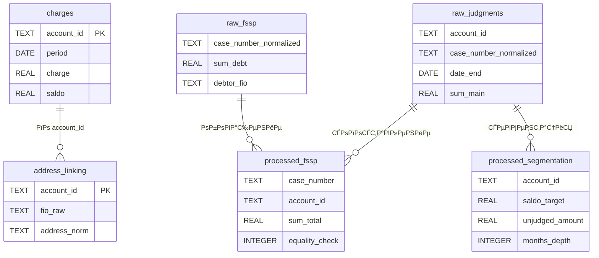
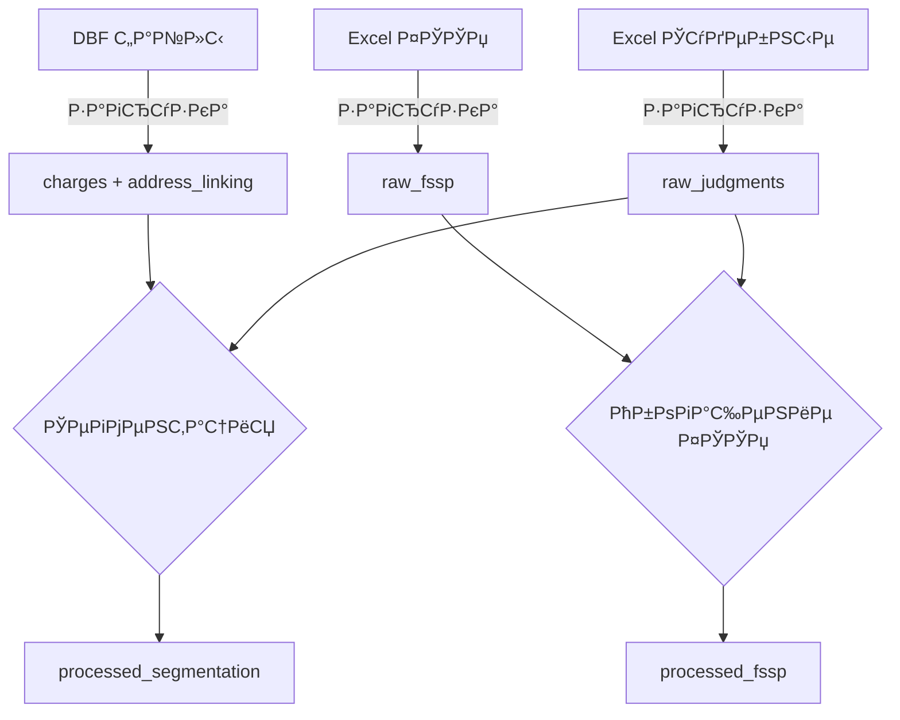

# Схема базы данных: debt_manager.db

**Дата обновления:** 2 марта 2026 г.

---

## Таблица: `charges`

**Количество записей:** 1 298 591

**Описание:** История начислений и сальдо по лицевым счетам (загружается из DBF файлов биллинга).

**Схема:**
|   cid | name        | type      |   notnull | dflt_value        |   pk |
|------:|:------------|:----------|----------:|:------------------|-----:|
|     0 | id          | INTEGER   |         0 | nan               |    1 |
|     1 | account_id  | TEXT      |         0 | nan               |    0 |
|     2 | period      | DATE      |         0 | nan               |    0 |
|     3 | charge      | REAL      |         0 | nan               |    0 |
|     4 | saldo       | REAL      |         0 | nan               |    0 |
|     5 | source_file | TEXT      |         0 | nan               |    0 |
|     6 | created_at  | TIMESTAMP |         0 | CURRENT_TIMESTAMP |    0 |

**Индексы:**
- `idx_billing_account` — по `account_id`
- `idx_billing_period` — по `period`

---

## Таблица: `address_linking`

**Количество записей:** 36 681

**Описание:** Справочник лицевых счетов с ФИО и адресами (загружается из DBF файлов).

**Схема:**
|   cid | name         | type      |   notnull | dflt_value        |   pk |
|------:|:-------------|:----------|----------:|:------------------|-----:|
|     0 | id           | INTEGER   |         0 | nan               |    1 |
|     1 | account_id   | TEXT      |         0 | nan               |    1 |
|     2 | fio_raw      | TEXT      |         0 | nan               |    0 |
|     3 | surnames     | TEXT      |         0 | nan               |    0 |
|     4 | address_raw  | TEXT      |         0 | nan               |    0 |
|     5 | address_norm | TEXT      |         0 | nan               |    0 |

**Индексы:**
- `idx_address_linking_norm` — по `address_norm`
- `idx_billing_surnames` — по `surnames`

---

## Таблица: `raw_fssp`

**Количество записей:** 3 732

**Описание:** Нормализованные данные из файла ФССП.

**Схема:**
|   cid | name                   | type      |   notnull | dflt_value        |   pk |
|------:|:-----------------------|:----------|----------:|:------------------|-----:|
|     0 | id                     | INTEGER   |         0 | nan               |    1 |
|     1 | case_number            | TEXT      |         0 | nan               |    0 |
|     2 | case_number_normalized | TEXT      |         0 | nan               |    0 |
|     3 | sum_debt               | REAL      |         0 | nan               |    0 |
|     4 | creditor               | TEXT      |         0 | nan               |    0 |
|     5 | account_id             | TEXT      |         0 | nan               |    0 |
|     6 | debtor_fio             | TEXT      |         0 | nan               |    0 |
|     7 | debtor_address         | TEXT      |         0 | nan               |    0 |
|     8 | debtor_address_norm    | TEXT      |         0 | nan               |    0 |
|     9 | fio_initials           | TEXT      |         0 | nan               |    0 |
|    10 | matching_key           | TEXT      |         0 | nan               |    0 |
|    11 | match_method           | TEXT      |         0 | nan               |    0 |
|    12 | match_confidence       | REAL      |         0 | nan               |    0 |
|    13 | created_at             | TIMESTAMP |         0 | CURRENT_TIMESTAMP |    0 |

**Индексы:**
- `idx_fssp_case` — по `case_number_normalized`
- `idx_fssp_matching_key` — по `matching_key`
- `idx_fssp_fio` — по `debtor_fio`

---

## Таблица: `raw_judgments`

**Количество записей:** 5 995

**Описание:** Нормализованные данные из судебных реестров (ЕИРЦ, УЖХ, ЕИАС).

**Схема:**
|   cid | name                   | type      |   notnull | dflt_value        |   pk |
|------:|:-----------------------|:----------|----------:|:------------------|-----:|
|     0 | id                     | INTEGER   |         0 | nan               |    1 |
|     1 | account_id             | TEXT      |         0 | nan               |    0 |
|     2 | case_number            | TEXT      |         0 | nan               |    0 |
|     3 | case_number_normalized | TEXT      |         0 | nan               |    0 |
|     4 | date_start             | DATE      |         0 | nan               |    0 |
|     5 | date_end               | DATE      |         0 | nan               |    0 |
|     6 | sum_main               | REAL      |         0 | nan               |    0 |
|     7 | sum_penalty            | REAL      |         0 | nan               |    0 |
|     8 | sum_duty               | REAL      |         0 | nan               |    0 |
|     9 | source                 | TEXT      |         0 | nan               |    0 |
|    10 | agent                  | TEXT      |         0 | nan               |    0 |
|    11 | status                 | TEXT      |         0 | nan               |    0 |
|    12 | created_at             | TIMESTAMP |         0 | CURRENT_TIMESTAMP |    0 |

**Индексы:**
- `idx_judgments_case` — по `case_number_normalized`
- `idx_judgments_account` — по `account_id`

---

## Таблица: `processed_fssp`

**Описание:** Результаты обогащения ФССП (Часть 1).

**Схема:**
|   cid | name             | type      |   notnull | dflt_value        |   pk |
|------:|:-----------------|:----------|----------:|:------------------|-----:|
|     0 | id               | INTEGER   |         0 | nan               |    1 |
|     1 | fssp_id          | INTEGER   |         0 | nan               |    0 |
|     2 | case_number      | TEXT      |         0 | nan               |    0 |
|     3 | account_id       | TEXT      |         0 | nan               |    0 |
|     4 | creditor         | TEXT      |         0 | nan               |    0 |
|     5 | period_start     | DATE      |         0 | nan               |    0 |
|     6 | period_end       | DATE      |         0 | nan               |    0 |
|     7 | sum_main         | REAL      |         0 | nan               |    0 |
|     8 | sum_penalty      | REAL      |         0 | nan               |    0 |
|     9 | sum_duty         | REAL      |         0 | nan               |    0 |
|    10 | sum_total        | REAL      |         0 | nan               |    0 |
|    11 | equality_check   | INTEGER   |         0 | nan               |    0 |
|    12 | match_method     | TEXT      |         0 | nan               |    0 |
|    13 | match_confidence | REAL      |         0 | nan               |    0 |
|    14 | created_at       | TIMESTAMP |         0 | CURRENT_TIMESTAMP |    0 |

**Методы сопоставления:**
- `CASE_NUMBER` — точное совпадение по номеру дела
- `FUZZY_CASE_NUMBER` — нечёткое совпадение по номеру дела
- `COMBINED_CASE_FIO` — комбинированное совпадение (дело + ФИО)
- `FIO_ADDRESS` — совпадение по ФИО и адресу

---

## 📊 Схема связей таблиц



**Поток данных:**



---

## Таблица: `processed_segmentation`

**Количество записей:** 26 758

**Описание:** Результаты сегментации долга (Часть 2).

**Схема:**
|   cid | name             | type      |   notnull | dflt_value        |   pk |
|------:|:-----------------|:----------|----------:|:------------------|-----:|
|     0 | id               | INTEGER   |         0 | nan               |    1 |
|     1 | account_id       | TEXT      |         0 | nan               |    0 |
|     2 | creditor         | TEXT      |         0 | nan               |    0 |
|     3 | cut_off_date     | DATE      |         0 | nan               |    0 |
|     4 | unprocessed_debt | REAL      |         0 | nan               |    0 |
|     5 | months_count     | INTEGER   |         0 | nan               |    0 |
|     6 | total_saldo      | REAL      |         0 | nan               |    0 |
|     7 | created_at       | TIMESTAMP |         0 | CURRENT_TIMESTAMP |    0 |

---

## Таблица: `error_log`

**Описание:** Журнал ошибок обработки.

**Схема:**
|   cid | name        | type      |   notnull | dflt_value        |   pk |
|------:|:------------|:----------|----------:|:------------------|-----:|
|     0 | id          | INTEGER   |         0 | nan               |    1 |
|     1 | error_type  | TEXT      |         0 | nan               |    0 |
|     2 | account_id  | TEXT      |         0 | nan               |    0 |
|     3 | case_number | TEXT      |         0 | nan               |    0 |
|     4 | source      | TEXT      |         0 | nan               |    0 |
|     5 | message     | TEXT      |         0 | nan               |    0 |
|     6 | created_at  | TIMESTAMP |         0 | CURRENT_TIMESTAMP |    0 |

**Типы ошибок:**
- `NO_MATCH` — не найдено соответствие при обогащении ФССП
- `EQUALITY_FAIL` — расхождение сумм ФССП и расчётных
- `LOAD_ERROR` — ошибка загрузки файла
- `SEGMENTATION_ERROR` — ошибка при сегментации

---

## Таблица: `processed_files`

**Описание:** Трекер обработанных файлов (для инкрементальной обработки).

**Схема:**
|   cid | name          | type      |   notnull | dflt_value        |   pk |
|------:|:--------------|:----------|----------:|:------------------|-----:|
|     0 | id            | INTEGER   |         0 | nan               |    1 |
|     1 | file_name     | TEXT      |         0 | nan               |    0 |
|     2 | file_path     | TEXT      |         0 | nan               |    0 |
|     3 | file_hash     | TEXT      |         0 | nan               |    0 |
|     4 | last_modified | REAL      |         0 | nan               |    0 |
|     5 | records_count | INTEGER   |         0 | nan               |    0 |
|     6 | processed_at  | TIMESTAMP |         0 | CURRENT_TIMESTAMP |    0 |

---

## Таблица: `raw_billing_all`

**Описание:** Сырые данные из DBF файлов (все 40+ колонок).

**Схема:**
|   cid | name        | type      |   notnull | dflt_value        |   pk |
|------:|:------------|:----------|----------:|:------------------|-----:|
|     0 | T0–T39      | TEXT      |         0 | nan               |    0 |
|    40 | period      | TEXT      |         0 | nan               |    0 |
|    41 | source_file | TEXT      |         0 | nan               |    0 |
|    42 | loaded_at   | TIMESTAMP |         0 | CURRENT_TIMESTAMP |    0 |

**Примечание:** Колонки T0–T39 соответствуют полям DBF файла.

---

## Таблица: `raw_fssp_all`

**Описание:** Сырые данные из Excel файла ФССП (все колонки).

**Схема:**
|   cid | name        | type      |   notnull | dflt_value        |   pk |
|------:|:------------|:----------|----------:|:------------------|-----:|
|     0 | id          | INTEGER   |         0 | nan               |    1 |
|     1 | source_file | TEXT      |         0 | nan               |    0 |
|     2 | loaded_at   | TIMESTAMP |         0 | CURRENT_TIMESTAMP |    0 |

---

## Таблица: `raw_uzh_all`

**Описание:** Сырые данные из Excel файла УЖХ (все колонки).

**Схема:**
|   cid | name        | type      |   notnull | dflt_value        |   pk |
|------:|:------------|:----------|----------:|:------------------|-----:|
|     0 | id          | INTEGER   |         0 | nan               |    1 |
|     1 | source_file | TEXT      |         0 | nan               |    0 |
|     2 | loaded_at   | TIMESTAMP |         0 | CURRENT_TIMESTAMP |    0 |

---

## Таблица: `raw_eirc_ip_all`

**Описание:** Сырые данные из Excel файла ЕИРЦ ИП (все колонки).

**Схема:**
|   cid | name        | type      |   notnull | dflt_value        |   pk |
|------:|:------------|:----------|----------:|:------------------|-----:|
|     0 | id          | INTEGER   |         0 | nan               |    1 |
|     1 | source_file | TEXT      |         0 | nan               |    0 |
|     2 | loaded_at   | TIMESTAMP |         0 | CURRENT_TIMESTAMP |    0 |

---

## Таблица: `raw_eirc_sudy_all`

**Описание:** Сырые данные из Excel файла ЕИРЦ Суды (все колонки).

**Схема:**
|   cid | name        | type      |   notnull | dflt_value        |   pk |
|------:|:------------|:----------|----------:|:------------------|-----:|
|     0 | id          | INTEGER   |         0 | nan               |    1 |
|     1 | source_file | TEXT      |         0 | nan               |    0 |
|     2 | loaded_at   | TIMESTAMP |         0 | CURRENT_TIMESTAMP |    0 |

---

## Таблица: `raw_eias_all`

**Описание:** Сырые данные из Excel файла ЕИАС (все колонки).

**Схема:**
|   cid | name        | type      |   notnull | dflt_value        |   pk |
|------:|:------------|:----------|----------:|:------------------|-----:|
|     0 | id          | INTEGER   |         0 | nan               |    1 |
|     1 | source_file | TEXT      |         0 | nan               |    0 |
|     2 | loaded_at   | TIMESTAMP |         0 | CURRENT_TIMESTAMP |    0 |

---

## Связи между таблицами

```
в”Њв”Ђв”Ђв”Ђв”Ђв”Ђв”Ђв”Ђв”Ђв”Ђв”Ђв”Ђв”Ђв”Ђв”Ђв”Ђв”Ђв”Ђв”ђ         в”Њв”Ђв”Ђв”Ђв”Ђв”Ђв”Ђв”Ђв”Ђв”Ђв”Ђв”Ђв”Ђв”Ђв”Ђв”Ђв”Ђв”Ђв”Ђв”ђ
в”‚   raw_fssp      в”‚         в”‚  raw_judgments   в”‚
│  (ФССП реестр)  │◄────────│ (Судебные решения)│
└────────┬────────┘  case   └───────┬──────────┘
         в”‚                          в”‚
         в”‚                          в”‚ account_id
         в–ј                          в–ј
в”Њв”Ђв”Ђв”Ђв”Ђв”Ђв”Ђв”Ђв”Ђв”Ђв”Ђв”Ђв”Ђв”Ђв”Ђв”Ђв”Ђв”Ђв”ђ         в”Њв”Ђв”Ђв”Ђв”Ђв”Ђв”Ђв”Ђв”Ђв”Ђв”Ђв”Ђв”Ђв”Ђв”Ђв”Ђв”Ђв”Ђв”Ђв”ђ
в”‚processed_fssp   в”‚         в”‚    charges       в”‚
│(Результаты ФССП)│         │ (История начисл.)│
└─────────────────┘         └────────┬─────────┘
                                     в”‚
                                     в”‚ account_id
                                     в–ј
                            в”Њв”Ђв”Ђв”Ђв”Ђв”Ђв”Ђв”Ђв”Ђв”Ђв”Ђв”Ђв”Ђв”Ђв”Ђв”Ђв”Ђв”Ђв”Ђв”ђ
                            в”‚address_linking   в”‚
                            │ (Справочник ЛС)  │
                            └────────┬─────────┘
                                     в”‚
                                     в”‚ account_id
                                     в–ј
                            в”Њв”Ђв”Ђв”Ђв”Ђв”Ђв”Ђв”Ђв”Ђв”Ђв”Ђв”Ђв”Ђв”Ђв”Ђв”Ђв”Ђв”Ђв”Ђв”ђ
                            в”‚processed_segment.в”‚
                            │ (Сегментация)    │
                            └──────────────────┘
```

---

## Индексы для ускорения поиска

| Таблица            | Индекс                        | Поле                |
|:-------------------|:------------------------------|:--------------------|
| raw_judgments      | idx_judgments_case            | case_number_normalized |
| raw_judgments      | idx_judgments_account         | account_id          |
| charges            | idx_billing_account           | account_id          |
| charges            | idx_billing_period            | period              |
| address_linking    | idx_address_linking_norm      | address_norm        |
| address_linking    | idx_billing_surnames          | surnames            |
| raw_fssp           | idx_fssp_case                 | case_number_normalized |
| raw_fssp           | idx_fssp_matching_key         | matching_key        |
| raw_fssp           | idx_fssp_fio                  | debtor_fio          |
""  
"---"  
""  
"## пїЅпїЅпїЅпїЅпїЅпїЅпїЅпїЅ"  
""  
"| [? � ��७� ९������](../README.md) | [?? ������� ���㬥����](README.md) | [?? ��](��.md) | [?? Changelog](CHANGELOG.md) | [?? �஡����](��������.md) |"  
"|:---------------------------------------|:-------------------------------------|:------------------|:----------------------------|:---------------------------|" 
